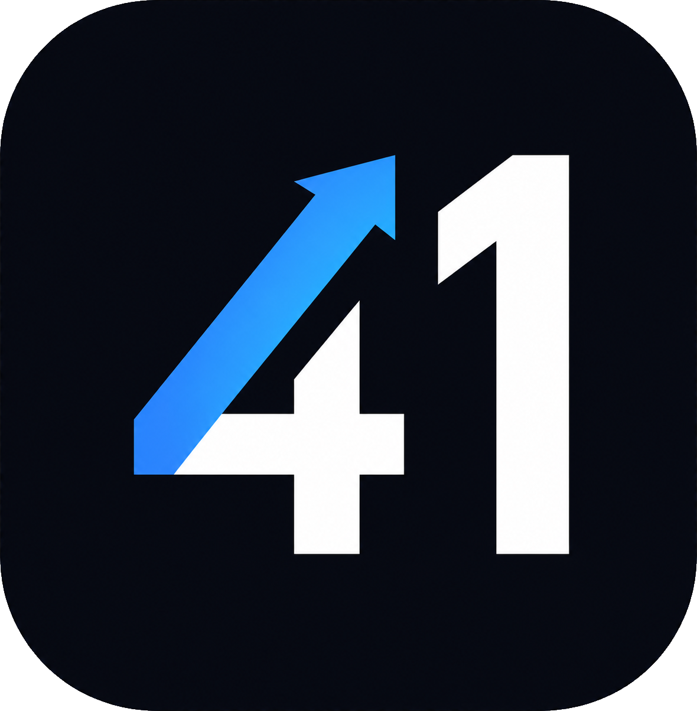

# Projeto 41

Webapp local para gestão de carteira financeira pessoal: cripto, ações da B3,
dólar, caixa, reserva de emergência e renda fixa — com dashboard, histórico
patrimonial, aportes, planejamento e alocação ideal.

Roda inteiramente na sua máquina (somente `127.0.0.1`), sem login e sem nuvem.
Os dados ficam num banco SQLite local e **nunca** são versionados.



## Últimos updates

Destaques recentes — histórico completo e versões em
[`CHANGELOG.md`](CHANGELOG.md).

- Cotações de cripto pela CoinGecko, com busca de moedas por símbolo ou nome no
  cadastro de operações.
- Cadastro de operação flexível: preencha dois dos três campos e o terceiro é
  calculado automaticamente.
- Carteira cripto: operação em USD ou BRL e opção de descontar a taxa Binance.
- Seletor de data e steppers numéricos no tema do app.

## Requisitos

- Node.js 22.13+ e npm 10+
- Funciona em Linux, macOS, Windows e WSL

## Instalação para desenvolvimento

```bash
git clone <url-do-seu-repositorio> projeto-41
cd projeto-41
cp .env.example .env
npm ci
npm run dev
```

No PowerShell, use `Copy-Item .env.example .env` no lugar de `cp`.

Abra **http://127.0.0.1:5173**. A API sobe em `http://127.0.0.1:3001`.

Na primeira execução o banco (`data/projeto41.sqlite`) é criado sem dados
financeiros e com metas de alocação genéricas, que podem ser ajustadas pela
interface. Não é preciso ter ou importar uma planilha.

## Execução de produção

Depois de configurar o `.env`:

```bash
npm ci
npm run build
npm start
```

Abra **http://127.0.0.1:3001**. Nesse modo a própria API entrega o frontend
compilado, então não é necessário manter o Vite em execução.

Este projeto não possui autenticação e foi feito para uso local. Não exponha a
porta diretamente na internet.

## Atalho na Área de Trabalho do Windows (WSL)

Com o projeto instalado dentro do WSL, execute uma vez:

```bash
npm run windows:shortcut
```

O comando cria um atalho chamado **Projeto 41** na Área de Trabalho do Windows.
Ao abrir o atalho:

- o servidor é reutilizado se já estiver em execução;
- dependências e frontend são preparados automaticamente se ainda não existirem;
- o servidor inicia oculto em segundo plano;
- o navegador abre em `http://127.0.0.1:3001`.

Em caso de erro, consulte `data/projeto41-launcher.log`. Se o projeto for movido
para outra pasta ou distribuição WSL, execute o comando novamente para recriar
o atalho.

## Como usar

Tudo é cadastrado e editado direto no app:

- **Cripto / Bolsa B3** — registre compras e vendas; quantidade, preço médio,
  saldo, PnL, peso e alocação são calculados automaticamente. O preço médio
  considera apenas as compras.
- **Caixa e renda fixa** — posições manuais de dólar, caixa, reserva de
  emergência e renda fixa, atualizadas por você.
- **Aportes** — acompanhamento mensal dos aportes do ano.
- **Planejamento** — simulador de patrimônio com aporte, rendimento e inflação.
- **Alocação** — defina a meta de cada classe arrastando o slider e compare com
  a carteira atual (a reserva fica fora da meta).
- **Histórico** — evolução patrimonial com snapshots diários.

Recursos extras na barra superior:

- **Atualizar preços** — força um novo ciclo de cotações.
- **Olho (privacidade)** — oculta valores e quantidades para gravar tela /
  mostrar para outras pessoas; porcentagens e cotações públicas continuam
  visíveis.
- **Tema** — alterna entre escuro e claro.

Os ícones de criptos e ações são baixados automaticamente de CDNs públicos na
primeira vez que aparecem e ficam em cache local (`data/icons/`), funcionando
offline depois.

## Cotações

| Fonte | Usada para | Configuração |
| --- | --- | --- |
| [brapi](https://brapi.dev) | Ações da B3 | `BRAPI_TOKEN` no `.env` (token gratuito) |
| Banco Central (PTAX) | USD/BRL | automático, sem chave |
| [CoinGecko](https://www.coingecko.com/en/api) | Criptomoedas | `COINGECKO_API_KEY` opcional (plano Demo) |
| `TZ` | Horários das atualizações e snapshots | fuso IANA, como `America/Sao_Paulo` |

Sem `BRAPI_TOKEN` as ações ficam sem cotação. As criptos usam o CoinGecko via
API pública mesmo sem chave; `COINGECKO_API_KEY` (plano Demo) eleva o limite de
requisições. O restante do app continua funcionando normalmente, e você pode
cadastrar operações de qualquer forma.

## Dados e privacidade

- Tudo fica em `data/` (banco SQLite + ícones). Essa pasta é ignorada pelo git.
- O servidor escuta apenas em `127.0.0.1`; nada é exposto para a rede.
- `Projeto 41.xlsx`, `.env`, banco e backups nunca são versionados.
- Exportação manual dos dados: `GET http://127.0.0.1:3001/api/export`.

## Modo demonstração

Para gravar vídeos/prints sem expor dados reais:

```bash
npm run demo
```

Abre em **http://127.0.0.1:5174** com um banco isolado e patrimônio sintético,
sem consultar provedores externos.

## Desenvolvimento

```bash
npm run dev        # API + frontend com hot reload
npm test           # testes (Vitest)
npm run typecheck  # checagem de tipos
npm run lint       # ESLint
npm run build      # build de produção
```

## Stack

Monorepo TypeScript: React + Vite no frontend, Fastify + better-sqlite3 no
backend, Zod nos contratos, Recharts nos gráficos e Vitest nos testes.

> O repositório inclui um importador legado (`npm run import`) que migra uma
> planilha específica do autor original. Ele é opcional e não é necessário para
> usar o app — comece do zero pela interface.
